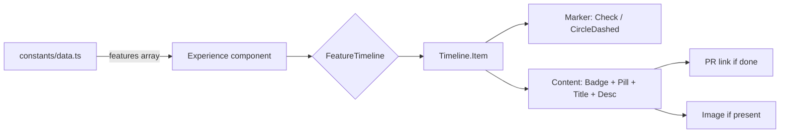

I recently added a **feature timeline** to my portfolio's Work Experience section to track the backend features I'm building at [Appwrite](https://appwrite.io). The goal was to make it look polished, support a done/pending workflow, and be editable straight from the GitHub repo — no database, just a data file.

Here's how it works, and a few of the tricks I used along the way.

## The architecture

The timeline is a vertical list of features. Each feature has a status marker on the left, and content on the right: a platform badge, a status pill, a title, a description, an optional PR link, and an optional preview image.



The data lives in a single TypeScript file, so flipping a feature from `pending` to `done` is a one-line change:

```ts
{
  platform: "Cloudflare",
  title: "Cloudflare OAuth2 provider",
  description: "Added Cloudflare as an OAuth2 authentication provider.",
  status: "done",  // ← flip this from "pending"
  link: "https://github.com/appwrite/appwrite/pull/13546",
}
```

## Status markers

I deliberately avoided using brand icons in the timeline markers. The brand icons already appear in the colored badges beside the text, so putting them in the markers too would be redundant and noisy. Instead:

- **Done** → a green `Check` icon (`lucide-react`)
- **Pending** → a static `CircleDashed` icon (no spinner animation)

The key insight: lucide icons have asymmetric path padding inside their 24×24 viewBox, so relying on flexbox centering makes them look off-center. I fixed it with absolute centering:

```css
.timeline__marker svg {
  position: absolute;
  top: 50%;
  left: 50%;
  transform: translate(-50%, -50%);
}
```

## Theme-aware wordmarks

Inline mentions of "Appwrite" in the bullet points render as the official Appwrite logotype instead of plain text. I downloaded both the black-text and white-text variants from Appwrite's brand assets page, and swap them with a single CSS rule:

```css
img.appwrite-wordmark {
  display: inline-block;
  height: 0.95em;
  width: auto;
  vertical-align: -0.18em;
}
.dark img.appwrite-wordmark {
  content: url("/brands/appwrite-wordmark-black.svg");
}
```

> **Gotcha:** the official asset filenames are named after the *background* they're for, not the text color. `appwrite-wordmark-black.svg` has *light* text (for dark backgrounds). I had the swap backwards at first and the wordmark was invisible in dark mode.

## The "maybe works there" framing

I'm an open-source contributor, not an Appwrite employee — but I wanted the bullet points to read like active platform development without claiming employment. The phrasing "Building backend features at Appwrite" and "Working alongside Matej Bačo (Engineering Lead)" gives that subtle impression while staying truthful.

## Editing from the repo

The best part: to mark a feature complete, I just edit `constants/data.ts` and push to `main`. The marker turns green, the "Done" pill appears, and the "View PR" link shows up. No deploy step, no database, no admin panel — just git.

That's the whole system. The timeline now tracks 11 features (3 done, 8 pending) across Appwrite, Cloudflare, Vercel, Supabase, Netlify, Firebase, Railway, Mailgun, and SendGrid.
