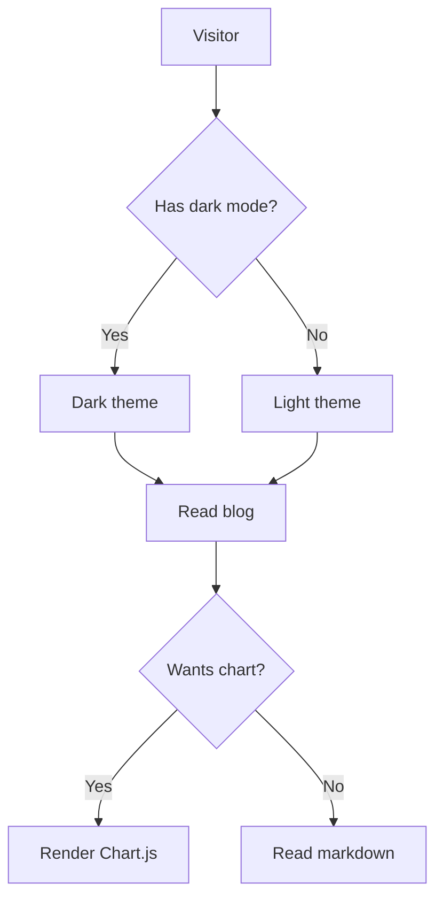
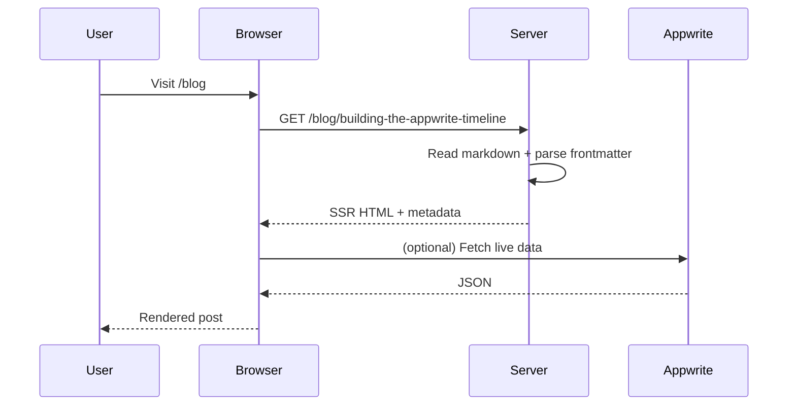

This post is a quick reference for everything the blog's markdown renderer supports. It's all [GitHub-Flavored Markdown](https://github.github.com/gfm/) plus a few custom extensions for mermaid diagrams and Chart.js charts.

## Headings

# H1 heading
## H2 heading
### H3 heading
#### H4 heading

## Text formatting

You can write **bold text**, *italic text*, ***bold italic***, ~~strikethrough~~, and `inline code`. You can also [link to things](https://appwrite.io) and embed images:


## Lists

### Unordered

- First item
- Second item
  - Nested item
  - Another nested item
- Third item

### Ordered

1. First
2. Second
3. Third

### Task lists

- [x] Completed task
- [x] Another completed task
- [ ] Pending task
- [ ] Another pending task

## Tables

| Feature | Status | Notes |
|---------|--------|-------|
| `getPhoto()` | ✅ Done | OAuth avatar fetching |
| Cloudflare OAuth2 | ✅ Done | New provider |
| `setPhoto()` | ○ Pending | Direct upload |
| OTP | ○ Pending | Email verification |

## Blockquotes

> "Building backend features at Appwrite — the open-source, self-hosted backend-as-a-service platform."
>
> — from my portfolio

Nested blockquotes work too:

> Outer quote
>> Inner quote
>>> Deepest quote

## Inline code

Use `const x = 42` for inline code. It renders with a subtle background and monospace font. You can also mention `function names`, `variable names`, and `file.ts` paths.

## Code blocks

### JavaScript

```javascript
function debounce(fn, delay) {
  let timer;
  return (...args) => {
    clearTimeout(timer);
    timer = setTimeout(() => fn(...args), delay);
  };
}

const log = debounce((msg) => console.log(msg), 300);
log("hello"); // debounced
```

### TypeScript

```typescript
interface Feature {
  platform: string;
  title: string;
  status: "done" | "pending";
  link?: string;
}

function isComplete(f: Feature): boolean {
  return f.status === "done";
}
```

### Python

```python
def fibonacci(n: int) -> list[int]:
    seq = [0, 1]
    while len(seq) < n:
        seq.append(seq[-1] + seq[-2])
    return seq[:n]

print(fibonacci(10))
# [0, 1, 1, 2, 3, 5, 8, 13, 21, 34]
```

### Bash

```bash
# Clone and run the portfolio
git clone https://github.com/imtia33/imtia33.git
cd imtia33
npm install
npm run dev
```

## Mermaid diagrams

### Flowchart



### Sequence diagram



## Links and references

External links open in a new tab: [Appwrite](https://appwrite.io), [Next.js docs](https://nextjs.org), [react-markdown](https://github.com/remarkjs/react-markdown).

## That's it

Everything above renders from a single markdown file with frontmatter. No MDX, no database, no admin panel — just `.md` files in `content/blog/` and a renderer that handles the rest.
