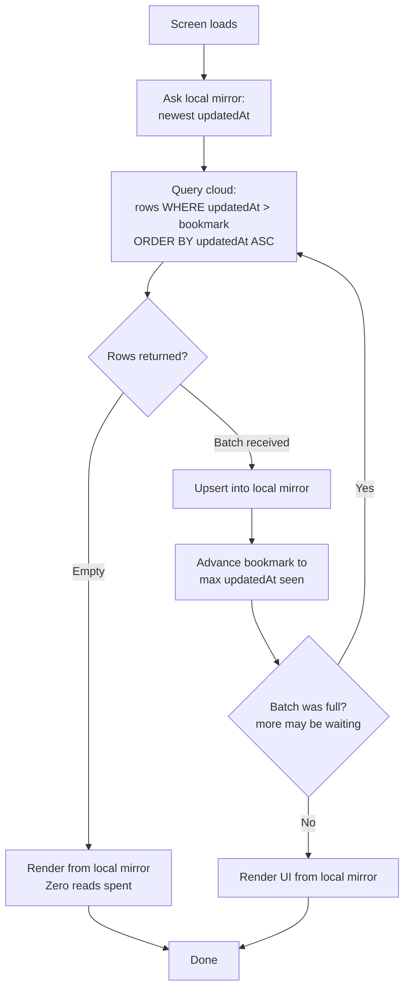

## The Origin

Every Appwrite plan that isn't enterprise has a ceiling you don't notice until you hit it: a hard monthly limit on reads and writes. It's sitting right there on the pricing page. Nobody reads it until it's too late.

I hit it.

I was building TravX, a mapping project. Road data, per city, thousands of segments, and they don't sit still, they update constantly as roads change, get added, get corrected. And that was just city scale. The plan was to expand to country scale, which meant thousands becoming millions. Every map screen, every pan, every re-open needed fresh road data from the database. And I had exactly one resource that mattered more than clean code, more than best practices, more than anything a tutorial ever told me: **I had no money.** Crossing that limit wasn't an inconvenience. It meant the app stops working until next month, or I pay for a plan I couldn't afford, and at millions of rows, that plan wasn't going to be cheap.

So before writing a single optimization, I asked one dumb question:

**Do I actually need to ask the database this many times?**

That question is the whole story.

## Assume This

Let's set up the experiment the way you'd set up any experiment: with an assumption, stated plainly, that we can then go test.

**Assume most of your data doesn't change between one visit and the next.**

Sounds obvious. But look at what a normal app actually does every time it opens: it asks the database for *everything*, every row, every field, regardless of whether a single byte changed since the last ask. It's the equivalent of calling a friend every morning and asking them to recite their entire life story from birth, just to find out what they did yesterday.

If the assumption is true, if most rows are quiet most of the time, then most of those reads are being spent to relearn things you already knew. Not slightly wasteful. **Structurally** wasteful, and it compounds with every user, every session, forever.

Time to test it.

## The Solution

No Incremental Static Regeneration to lean on. That's a web trick, and this was mobile. No invisible edge cache doing the thinking for me. If the app was going to stop repeating itself, I had to teach it to.

**The setup:** a local database on the device, structurally identical to the one in the cloud. Same tables, same columns. A mirror, kept close.

A mirror by itself saves nothing. The saving comes from *how you consult it.*

Every Appwrite document carries two timestamps: `$createdAt` and `$updatedAt`. Quiet metadata, until you realize it's actually a receipt. Before touching the network, I ask the *local* mirror one question: **what's the newest thing you already know?** That timestamp becomes a bookmark, the line between "already learned" and "still unknown."

Then, instead of asking the cloud for everything, I ask for only what happened *after* the bookmark. A brand-new row has an identical `$createdAt` and `$updatedAt` by definition, so this one question catches new rows and edited rows in the same net. If what comes back is empty, that's the signal: fully caught up. Render from the local copy. **Zero reads spent.**

## The Equation

Let:
- **N** = total rows in a table
- **Δ̄** = average rows that actually change between one visit and the next
- **k** = the small fixed cost of just asking "did anything happen?"
- **S** = total visits, over any span of time

**Naive approach**, ask for everything, every visit:

$$R_{naive}(S) = S \cdot N$$

**Bookmark approach**, ask only for what changed:

$$R_{delta}(S) = S \cdot (k + \bar{\Delta})$$

**The reduction:**

$$\text{Reduction} = \frac{R_{naive}(S)}{R_{delta}(S)} = \frac{N}{k + \bar{\Delta}}$$

Here's the part that should stop you: **S cancels out.** It doesn't matter if a user opens the app five times or five thousand times, the *ratio* of savings never moves. The payoff isn't about how often people use the app. It's about the *shape* of the table: how big it is, versus how much of it is actually alive.

A huge, mostly-static table, a catalog, a settings list, a directory, hands you the biggest win possible. A small, constantly-churning table, a live chat, a ticking counter, hands you almost nothing. The equation isn't describing the result after the fact. It's telling you, before you write a line of code, exactly where this trick is worth using at all.

## The Result

Same app, 30 visits, two strategies, side by side:

Both lines are straight, that threw me at first. I expected the smart one to curve and flatten heroically over time. It doesn't. It climbs at the *same steady rate* as the naive one, just a far gentler slope. Patient instead of frantic.

By visit 30, the naive approach has spent **277,200 reads** relearning things it already knew. The bookmark approach has spent **4,200**.

**66x fewer reads, for remembering the exact same thing.** Against a hard monthly ceiling and zero budget, that's not an optimization, that's the difference between an app that survives the month and one that gets shut off mid-month.

## The Technical Implementation

Step by step, on every screen load:

1. **Ask the local mirror** for its bookmark, the newest `updatedAt` it already has.
2. **Query the cloud** for rows where `updatedAt > bookmark`, ordered ascending.
3. **Nothing comes back?** Fully caught up, render locally, zero reads spent.
4. **Something comes back?** Upsert it into the local mirror (new rows insert, changed rows overwrite), advance the bookmark to the max `updatedAt` seen, and if the batch was full, loop back to step 2, there may be more waiting.
5. **Render the UI from the local mirror**, not from whatever just came off the wire.

## The Cons

Nothing this cheap comes free. Two catches, in order of how much they hurt.

**1. Deletions are invisible.** A deleted row doesn't leave an `$updatedAt` behind, it just stops existing. The bookmark method has no way to perceive an absence. The local mirror keeps believing in something the cloud has already let go of. This isn't a bug I patched, it's the actual price of the strategy. (Planned fix: soft-delete tombstones, a marker kept just long enough for a sync pass to notice it and clean up the ghost.)

**2. The temptation I talked myself out of.** I could have reached for a real-time, always-open connection that pushes changes the instant they happen, no asking required. Genuinely elegant engineering. Also the exact opposite of what I needed. I wasn't trying to know everything the moment it happened, I was trying to **ask less often, period.** A connection that never closes still costs something, even in total silence. I let it go.
